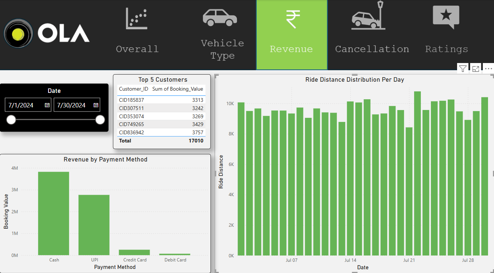
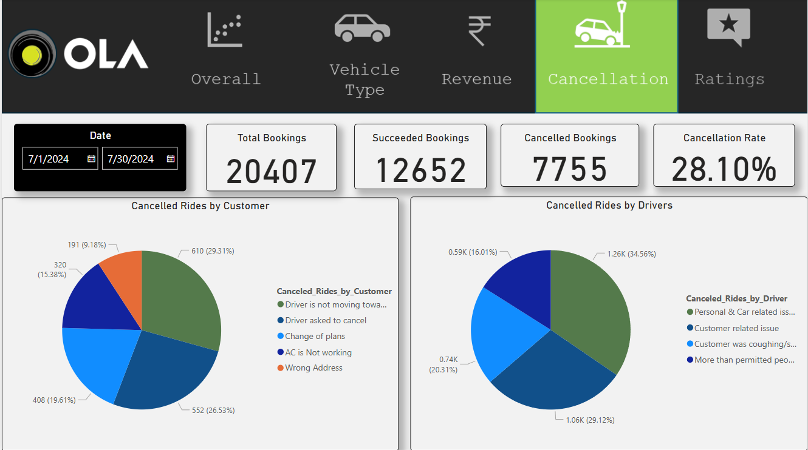
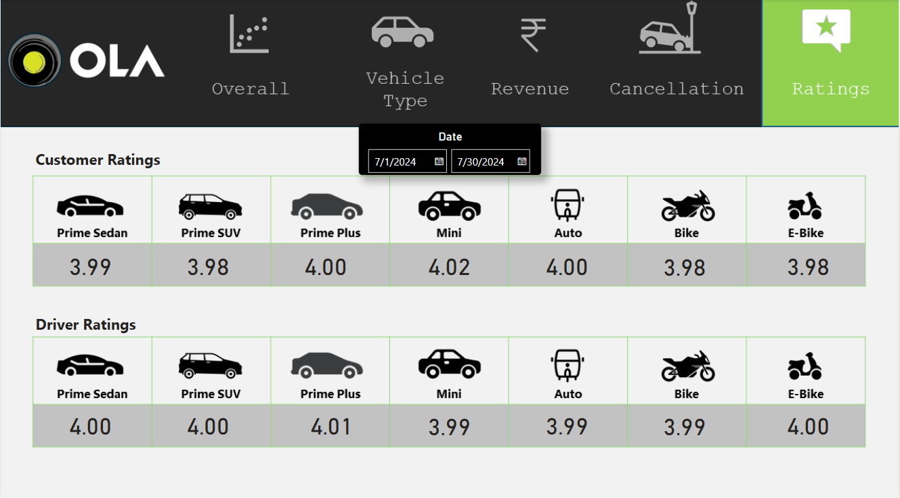

# 📊 Ola Ride Analytics Dashboard
A Power BI dashboard and SQL analysis project using a 20,000+ Ola ride records dataset to extract actionable business insights such as revenue trends, cancellation behavior, customer value, and driver performance.

## 🛠️ Tools & Technologies
- **SQL** – Data cleaning and querying
- **Power BI** – Data visualization and dashboard creation
- **DAX** – Custom calculated measures and logic

## 📊 Dashboard Highlights
### Bookings Overview  

### Vehicle Type   

### Revenue

### Cancellation  

### Ratings

The dashboard is divided into five main sections:

### 1. 🚦 Overall Bookings Overview
- **Total Records Analyzed**: 20,407
- **Success Rate**: ✅ 62%
- **Cancellation Rate**: ❌ 38.01%
  - Cancelled by Drivers: 17.91%
  - Cancelled by Customers: ~10.2%
  - Driver Not Found: ~9.9%
  
🔍 **Insight**: Driver-side issues contribute significantly to the cancellation rate, affecting customer experience. A 28.1% cancellation rate is alarming. Since most cancellations are driver-related, this indicates:

- Potential issues with driver availability or incentives
- Need for driver engagement strategies and better ride-matching algorithms

📌 **Actionable Suggestion**: Introduce penalty for frequent cancellations & incentives for peak-hour availability.

---

### 2. 🚗 Vehicle Type Analysis
- Total & Successful Booking Value per Vehicle
- Average and Total Distance Travelled
- Ratings Analysis by Vehicle Type

💡 **Insight**:
- **Mini** received the **highest customer ratings** suggesting strong affordability and satisfaction.
- **Prime Plus** received the **highest driver ratings** possibly due to better fares or vehicle comfort.

📌 **Actionable Idea**: Expand Mini fleet for customer satisfaction and retain Prime Plus for high-value driver experience. Offer retention bonuses to Prime Plus drivers to reduce churn.

---

### 3. 💸 Revenue & Payment Trends
- Revenue Breakdown by **Payment Method**
- Top 5 Customers by Total Spend
- Ride Distance Distribution by Date

📊 **Finding**:
- Most transactions were **cash-based**
- High cash payments mean more operational friction and potential leakage.
- Low rides on Sundays signal a weekend dip in urban mobility.

📌 **Actionable Idea**: 
- Promote digital wallet offers to increase non-cash usage.
- Introduce Sunday ride discounts to boost off-peak traffic.

---

### 4. ❌ Cancellations 
- Driver-side cancellations outnumbered customer ones.
- **Top reasons**: Personal issues and care-related emergencies.

📊 **Finding**:
- High driver-side cancellation leads to poor customer experience and revenue loss.

📌 **Actionable Idea**: Introduce backup driver systems and better driver availability policies.

---

### 5. ⭐ Ratings Analysis
- **Mini** cars has the happiest customers
- **Prime Plus** is the most liked by drivers

📊 **Key Insight**:
- Customer loyalty is high for Mini due to affordability and reliability.
- Drivers may prefer Prime Plus due to better earning potential.

📌 **Actionable Idea**:
- Boost Mini fleet size to improve customer satisfaction.
- Leverage driver feedback from Prime Plus to improve onboarding and training across vehicle types.

---

## 🔍 Additional Opportunities (Future Work)

- Geo-mapping booking & cancellation clusters
- Churn prediction based on booking frequency
- Forecasting high-demand time slots
- Customer segmentation for targeted campaigns

---

## 📬 Contact
For any queries or suggestions, feel free to reach out:  
📧 anushadhiman101@gmail.com  
🌐 [LinkedIn](https://linkedin.com/in/anusha3768)
